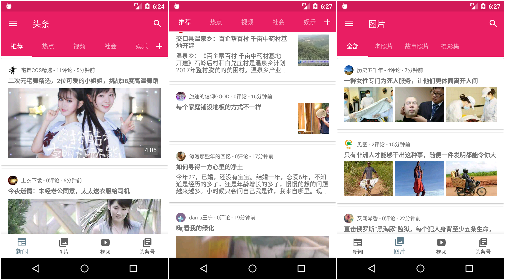
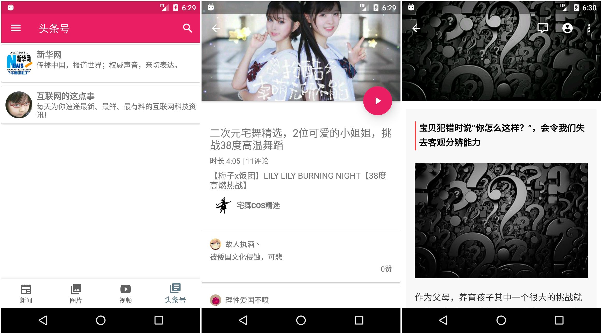
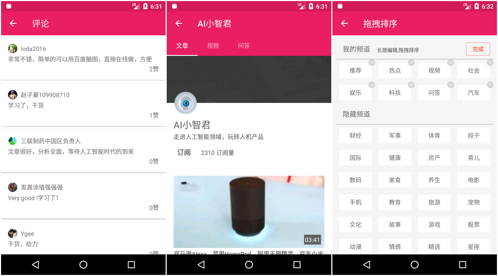
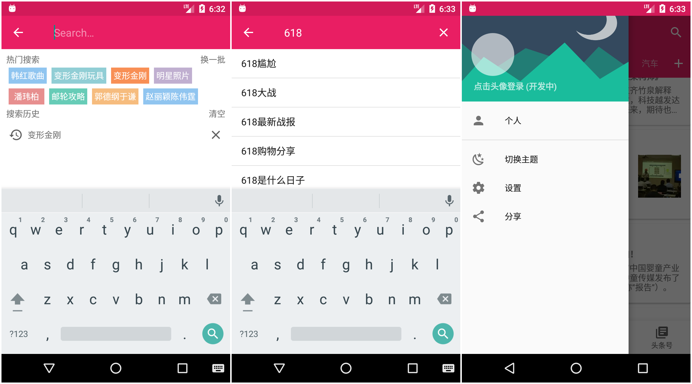
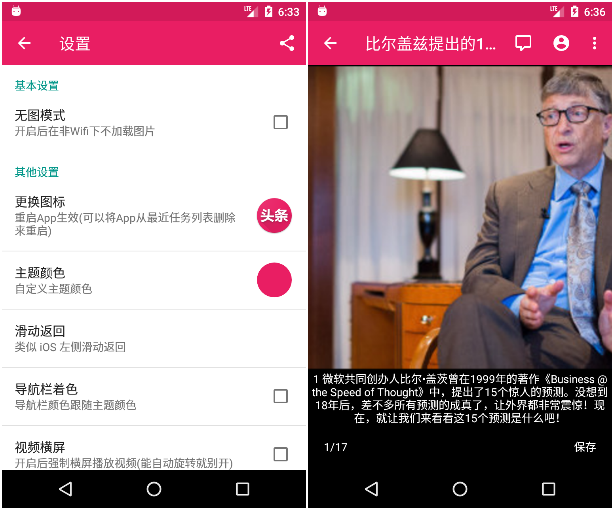

[![Platform][1]][2]  [![Build Status][3]][4]  [![Release][5]][6]  [![GitHub license][7]][8] 

[1]:https://img.shields.io/badge/platform-Android-blue.svg  
[2]:https://github.com/iMeiji/Toutiao
[3]:https://travis-ci.org/iMeiji/Toutiao.svg?branch=master
[4]:https://travis-ci.org/iMeiji/Toutiao
[5]:https://img.shields.io/github/release/iMeiji/Toutiao.svg
[6]:https://github.com/iMeiji/Toutiao/releases/latest
[7]:https://img.shields.io/badge/license-Apache%202-blue.svg
[8]:https://github.com/iMeiji/Toutiao/blob/master/LICENSE


## 头条


头条是一款遵循材料设计(Material Design)的第三方今日头条客户端, 聚合了新闻/段子/图片/视频/头条号内容, 没有广告, 仅仅只有存粹的阅读, 不断完善中, 采用 MVP + RxJava + Retrofit 架构的项目

其中API来自 [今日头条Api分析](https://github.com/iMeiji/Toutiao/wiki/%E4%BB%8A%E6%97%A5%E5%A4%B4%E6%9D%A1Api%E5%88%86%E6%9E%90)


## Statement
以下所有 API 均由 `今日头条` 提供, 本人采取非正常手段获取. 本程序仅供学习交流, 不可用于任何商业用途


## Features
- 首页五大模块: 新闻 / 图片 / 视频 / 头条号 / 问答
- 实现首页的布局和数据的显示
- 实现自定义新闻栏目顺序
- 新闻详情页面支持日夜两种主题
- 显示新闻评论
- 头条号订阅 查看头条号历史文章 / 视频
- 搜索功能 热门搜索推荐 搜索历史记录
- 自定义主题颜色 无缝切换日夜皮肤
- 视频播放
- 内置3款 logo 随意互换
- 动态切换字体大小


## Screenshots







## Preview


## Download
由于侵犯 `今日头条` 版权, 故不再提供 APK 下载


## Points
- 基本遵循 Material Design 设计风格
- 抓包获取今日头条API
- 使用 [Google 官方 MVP 架构](https://github.com/googlesamples/android-architecture/tree/todo-mvp/) 
- DrawerLayout + NavigationView + BottomNavigationView 搭配使用
- RxBus 代替 EventBus 进行组件之间通讯
- ViewPager 搭配 Fragment 懒加载
- SwipeRefreshLayout 搭配 RecyclerView 下拉刷新上拉加载
- 自定义 BottomNavigationBehavior 实现上滑隐藏下滑显示
- RxJava + Retrofit2 + OkHttp3 做网络请求
- OkHttp3 对网络返回内容做缓存, 还有日志、超时重连、头部消息的配置
- V层基类的构建, 包括 BaseActivity 和 BaseFragment , 对外提供了相同的接口
- 使用原生的夜间模式
- 解决侧滑返回与 View 冲突问题
- 内置 3 款 Logo, 随意切换
- 使用 CoordinatorLayout 、 AppBarLayout 、 CollapsingToolbarLayout 、 BottomSheetDialog 等等新控件
- 使用 7.0 新工具 DiffUtil , 不再无脑 notifyDataSetChanged
- 使用 ItemTouchHelper 实现今日头条的频道排序、频道移动, 参考 [ItemTouchHelperDemo](https://github.com/YoKeyword/ItemTouchHelperDemo)
- 使用 RxBinding 优雅实现搜索请求
- 使用 RxLifecycle 绑定 RxJava 生命周期
- 使用 Travis Cl 持续集成


## Changelog
```
2017-11-11
优化启动页面

2017-9-5
添加使用说明, 首次启动会引导用户使用

2017-8-27
解决新闻栏目位置调换后 recreate 

2017-8-17
添加字体大小设置选项

2017-7-25
添加双击底栏按钮监听事件

2017-7-24
添加自动切换夜间模式选项

2017-7-22
修复 S8 播放视频bug
更新API

2017-7-20
添加滑动返回
更新新闻阅读 UI
修复 bug

2017-7-18
添加自定义图标选项

2017-7-14
解决使用BottomSheetDialog时状态栏变黑的问题

2017-7-12
优化"加载完毕"的提示
视频界面支持透明状态栏

2017-7-6
支持查看头条号主页
优化头条号订阅
更新视频 API

2017-7-2
自定义颜色的BUG修正

2017-6-29
修复新闻加载

2017-6-25
添加热门搜索

2017-6-22
添加搜索建议

2017-6-17
添加搜索历史记录

2017-6-16
重写搜索模块(beta)
重构代码

2017-6-4
添加导航栏着色设置选项
添加视频横屏设置选项
调整 UI 颜色

2017-5-31
封装 ImageLoader
ViewPager 动态更新

2017-5-30
修复新闻重复 bug

2017-5-25
更换 API
添加 N 多新闻栏目
添加头条问答模块

2017-5-19
新闻 "推荐" 栏目支持浏览 新闻 / 视频(beta)

2017-5-18
更新获取评论 API
所有 UI 控件配色跟随主题颜色
优化无图模式 (开启后在非Wifi下不加载图片)

2017-5-15
修复颜色错乱 bug
屏蔽视频播放器无用的按钮
更新列表 item 布局
视频播放界面全屏沉浸式

2017-5-12
修复闪退 bug 
增加自定义主题颜色

2017-5-11
修复无法下拉刷新 bug
重构项目

2017-5-9
更新部分 UI
图片浏览器若获取数据失败 则采用 WebView 加载

2017-4-18
修复新闻重复 bug (DiffUtil解决) 

2017-4-15
添加头条号订阅
优化清除缓存

2017-4-4
添加视频模块

2017-3-26
修复 Fragment 出栈 bug
增加 about 界面

2017-3-23
完善设置界面

2017-3-16
修复屏幕旋转重新加载
优化 RecyclerView 显示加载更多

2017-3-13
添加拖拽标签

2017-3-6
修复6.0运行时权限

2017-3-2
添加预加载

2017-2-26
优化无图/夜间模式

2017-2-25
部分界面支持点击 Toolbar 返回顶部
优化 BottomSheet 界面
优化无图模式(beta)

2017-2-23
添加夜间模式切换(beta)

2017-2-22
WebView无图模式(beta)

2017-2-21
修复bug

2017-2-20
添加设置界面
添加无图模式(beta)

2017-2-19
添加图片保存
优化评论列表界面(使用 BottomSheetDialog 代替 MaterialDialog)
添加6.0运行时权限

2017-2-18
完善图片浏览(ViewPager + PhotoView)

2017-2-16
添加图片专栏

2017-2-8
第一版正式发布

2017-2-7
添加搜索功能
```

## TODO
- WebView无图模式支持点击加载图片
- 本地缓存(待定)
- 视频支持切换分辨率
- 本地新闻
- 视频离线缓存
- 浏览历史
- 收藏夹


## Libraries
- [Android Support Libraries](https://developer.android.com/topic/libraries/support-library/index.html)
- [Gson](https://github.com/google/gson)
- [Glide](https://github.com/bumptech/glide)
- [jsoup](https://jsoup.org/)
- [PhotoView](https://github.com/chrisbanes/PhotoView)
- [LicensesDialog](https://github.com/PSDev/LicensesDialog)
- [JieCaoVideoPlayer](https://github.com/lipangit/JieCaoVideoPlayer)
- [Retrofit](https://github.com/square/retrofit)
- [PersistentCookieJar](https://github.com/franmontiel/PersistentCookieJar)
- [RxJava](https://github.com/ReactiveX/RxJava)
- [RxAndroid](https://github.com/ReactiveX/RxAndroid)
- [RxLifecycle](https://github.com/trello/RxLifecycle)
- [OkHttp](https://github.com/square/okhttp)
- [Material Dialogs](https://github.com/afollestad/material-dialogs)
- [PermissionsDispatcher](https://github.com/hotchemi/PermissionsDispatcher)
- [Stetho](https://github.com/facebook/stetho)
- [MultiType](https://github.com/drakeet/MultiType)
- [RxBinding](https://github.com/JakeWharton/RxBinding)
- [FlexboxLayout](https://github.com/google/flexbox-layout)
- [Slidr](https://github.com/r0adkll/Slidr)


## End
注意：此开源项目仅做学习交流使用, 不可用于任何商业用途. 如果你觉得不错, 对你有帮助, 欢迎点个 fork, star, follow , 也可以帮忙分享给你更多的朋友, 这是给作者最大的动力与支持


## License
```
Copyright 2017 iMeiji

Licensed under the Apache License, Version 2.0 (the "License");
you may not use this file except in compliance with the License.
You may obtain a copy of the License at

    http://www.apache.org/licenses/LICENSE-2.0

Unless required by applicable law or agreed to in writing, software
distributed under the License is distributed on an "AS IS" BASIS,
WITHOUT WARRANTIES OR CONDITIONS OF ANY KIND, either express or implied.
See the License for the specific language governing permissions and
limitations under the License.
```