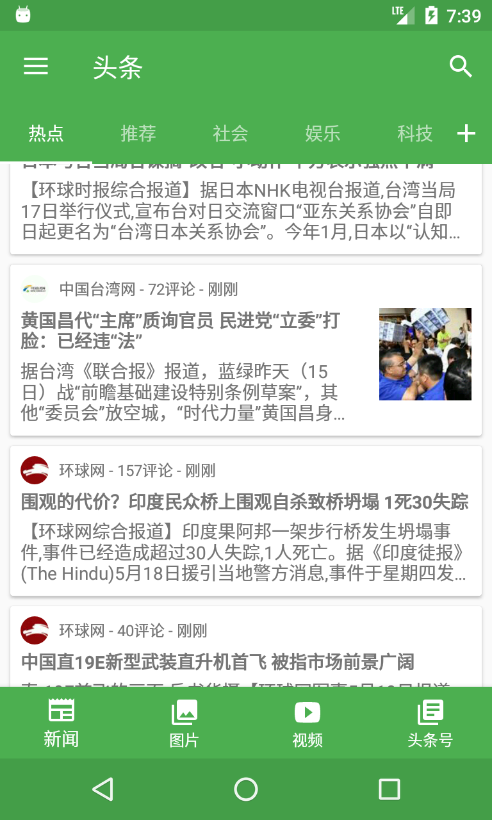
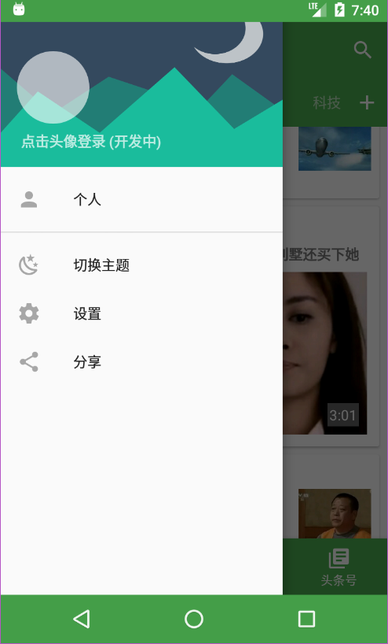
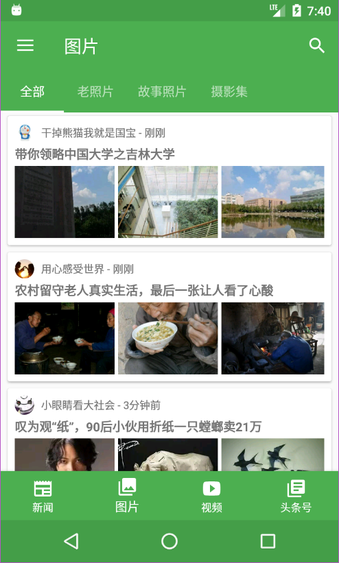
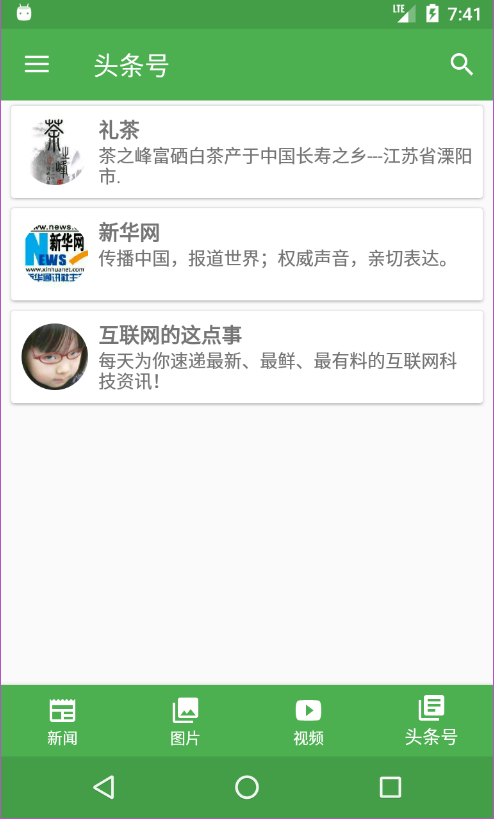
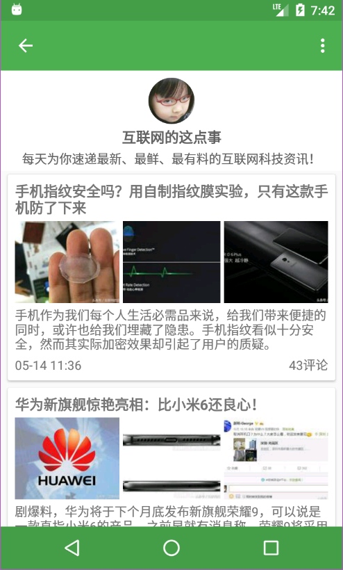
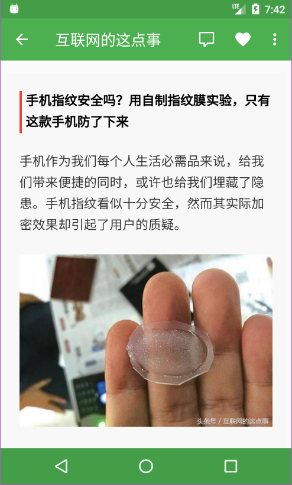
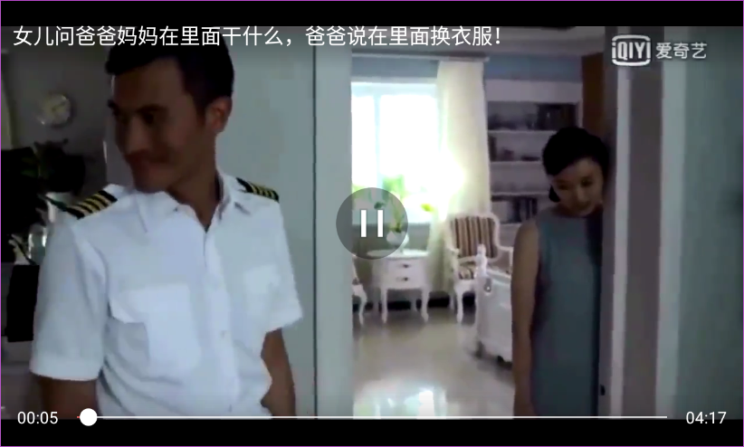

[![Platform][1]][2]  [![Build Status][3]][4]  [![Release][5]][6]  [![GitHub license][7]][8] 

[1]:https://img.shields.io/badge/platform-Android-blue.svg  
[2]:https://github.com/iMeiji/Toutiao
[3]:https://travis-ci.org/iMeiji/Toutiao.svg?branch=master
[4]:https://travis-ci.org/iMeiji/Toutiao
[5]:https://img.shields.io/github/release/iMeiji/Toutiao.svg
[6]:https://github.com/iMeiji/Toutiao/releases/latest
[7]:https://img.shields.io/badge/license-Apache%202-blue.svg
[8]:https://github.com/iMeiji/Toutiao/blob/master/LICENSE


## Toutiao
一款第三方今日头条客户端, 不断完善中, MVP + RxJava + Retrofit

其中API来自 [今日头条Api分析](https://github.com/iMeiji/Toutiao/wiki/%E4%BB%8A%E6%97%A5%E5%A4%B4%E6%9D%A1Api%E5%88%86%E6%9E%90)


## Statement
以下所有 API 均由 `今日头条` 提供, 本人采取非正常手段获取. 本程序仅供学习交流, 不可用于任何商业用途

## Features
- 首页五大模块: 新闻 / 图片 / 视频 / 头条号 / 问答
- 实现首页的布局和数据的显示
- 实现自定义新闻栏目顺序
- 新闻详情页面支持日夜两种主题
- 显示新闻评论
- 头条号订阅 查看头条号历史文章
- 搜索功能 热门搜索推荐 搜索历史记录
- 自定义主题颜色 无缝切换日夜皮肤
- 视频播放


## Screenshots


<a href="art/1.png">
<a href="art/2.png">
<a href="art/3.png">

<a href="art/4.png">
<a href="art/5.png">
<a href="art/6.png">

<a href="art/7.png">
<a href="art/8.png">
<a href="art/9.png">

<a href="art/10.png">
<a href="art/11.png">


## Download
[酷安](http://www.coolapk.com/apk/com.meiji.toutiao)  
[GitHub Release](https://github.com/iMeiji/Toutiao/releases)

## Changelog
```
2017-6-25
添加热门搜索

2017-6-22
添加搜索建议

2017-6-17
添加搜索历史记录

2017-6-16
重写搜索模块(beta)
重构代码

2017-6-4
添加导航栏着色设置选项
添加视频横屏设置选项
调整 UI 颜色

2017-5-31
封装 ImageLoader
ViewPager 动态更新

2017-5-30
修复新闻重复 bug

2017-5-25
更换 API
添加 N 多新闻栏目
添加头条问答模块

2017-5-19
新闻 "推荐" 栏目支持浏览 新闻 / 视频(beta)

2017-5-18
更新获取评论 API
所有 UI 控件配色跟随主题颜色
优化无图模式 (开启后在非Wifi下不加载图片)

2017-5-15
修复颜色错乱 bug
屏蔽视频播放器无用的按钮
更新列表 item 布局
视频播放界面全屏沉浸式

2017-5-12
修复闪退 bug 
增加自定义主题颜色

2017-5-11
修复无法下拉刷新 bug
重构项目

2017-5-9
更新部分 UI
图片浏览器若获取数据失败 则采用 WebView 加载

2017-4-18
修复新闻重复 bug (DiffUtil解决) 

2017-4-15
添加头条号订阅
优化清除缓存

2017-4-4
添加视频模块

2017-3-26
修复 Fragment 出栈 bug
增加 about 界面

2017-3-23
完善设置界面

2017-3-16
修复屏幕旋转重新加载
优化 RecyclerView 显示加载更多

2017-3-13
添加拖拽标签

2017-3-6
修复6.0运行时权限

2017-3-2
添加预加载

2017-2-26
优化无图/夜间模式

2017-2-25
部分界面支持点击 Toolbar 返回顶部
优化 BottomSheet 界面
优化无图模式(beta)

2017-2-23
添加夜间模式切换(beta)

2017-2-22
WebView无图模式(beta)

2017-2-21
修复bug

2017-2-20
添加设置界面
添加无图模式(beta)

2017-2-19
添加图片保存
优化评论列表界面(使用 BottomSheetDialog 代替 MaterialDialog)
添加6.0运行时权限

2017-2-18
完善图片浏览(ViewPager + PhotoView)

2017-2-16
添加图片专栏

2017-2-8
第一版正式发布

2017-2-7
添加搜索功能
```

## TODO
- WebView无图模式支持点击加载图片
- 本地缓存(待定)
- 视频支持切换分辨率
- 本地新闻
- 订阅号要分类 新闻 / 图片 / 视频
- 视频离线缓存
- 更新视频 API 
- 模拟登陆头条账号
- 栏目位置调换后不 recreate
- 滑动返回
- 搜索结果区分新闻和视频

## License
```
Copyright 2017 iMeiji

Licensed under the Apache License, Version 2.0 (the "License");
you may not use this file except in compliance with the License.
You may obtain a copy of the License at

    http://www.apache.org/licenses/LICENSE-2.0

Unless required by applicable law or agreed to in writing, software
distributed under the License is distributed on an "AS IS" BASIS,
WITHOUT WARRANTIES OR CONDITIONS OF ANY KIND, either express or implied.
See the License for the specific language governing permissions and
limitations under the License.
```